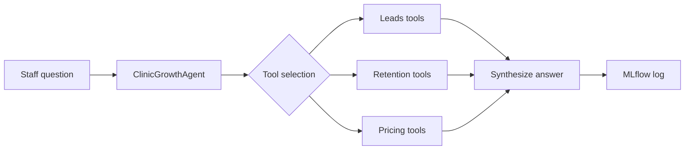

# Architecture — Clinic Growth Agent

## Problem

A chiropractic clinic wants to grow **revenue** and **profit margin**. This solution is an **agentic AI assistant** on **Databricks Free Edition** that recommends actions across three strategic focus areas.

## Focus areas → agent tools

| Focus area | Tools | Example questions |
|------------|-------|-------------------|
| **Leads** | `analyze_lead_pipeline`, `score_lead_quality` | "Which leads should we call today?" |
| **Retention** | `identify_at_risk_patients`, `care_plan_completion_summary` | "Who is at risk of dropping off?" |
| **Pricing** | `analyze_service_margins`, `recommend_membership_offers` | "Where can we improve margins?" |

## Design principles

1. **Config separated from code** — prompts, clinic profile, and UC targets live in `config/*.yaml`.
2. **Modular tools** — each focus area is a Python module with pure functions + `ToolDefinition` wrappers.
3. **Agent orchestrator** — selects tools, executes them, synthesizes an answer (heuristic locally; Foundation Model on Databricks).
4. **Databricks-centric** — Unity Catalog tables, serverless notebooks/jobs, MLflow experiment tracking.
5. **Deploy via DAB** — `databricks.yml` defines jobs, experiment, and file sync.

## Flow

## Free Edition notes

- **Serverless only** — jobs use `environment_key: Default` (no classic clusters).
- **Foundation Models** — set `use_model=true` in `02_run_agent` when endpoint is available.
- **Limits** — 5 concurrent job tasks; one small SQL warehouse; no GPU serving.

## Extension ideas for hackathon

- Swap sample data for real (de-identified) clinic exports in Unity Catalog.
- Add Vector Search over SOP/playbook docs for grounded outreach templates.
- Register the agent as a Custom Agent / Model Serving endpoint if quota allows.
- Build a Databricks App front-end for front-desk staff.
